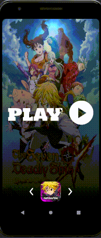
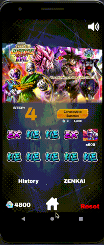

# Gacha-Simulator
Interactive GUI summoning simulator from Dokkan Battle, Genshin Impact, Dragon Ball Legends, Seven Deadly Sins.

Features graphical card assets, summoning budget option, summoning statistics, currency counter/countdown, main menu, background music, finger gestures, animations, navigational tools and prompts.

# Contributers
Junior Green<<juniorgreen@cmail.carleton.ca>>

# Gallery

**Splash Screen**

**Home Menu**

**Dokkan Transition into Summon**

**Budget Feature**

**History Feature**

**Stats Feature** (Inaccurate background blurring)

**Legends Summoning and Banner Transitions**

**Seven Deadly Sins Summoning and Transition**

